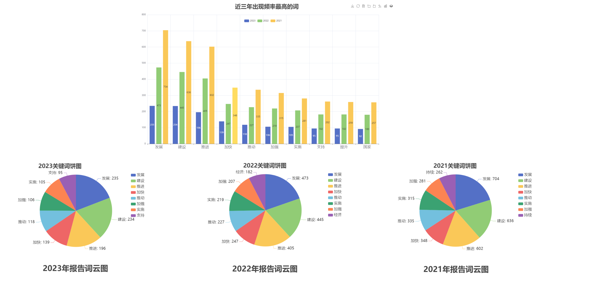
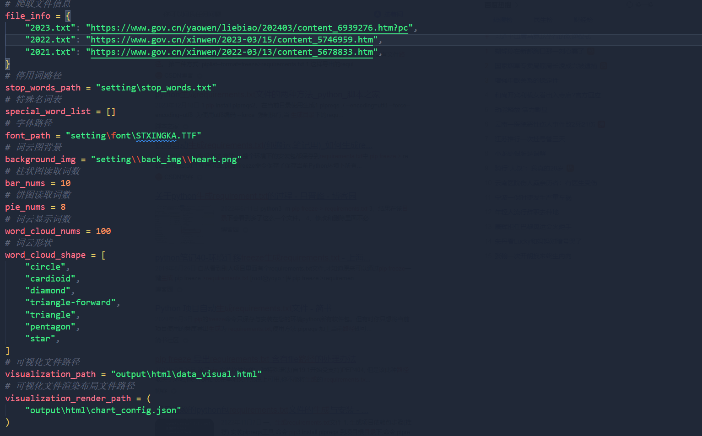

## 项目展示

爬取中华人民共和国中央人民政府官网最近三年国民经济和社会发展计划执行情况报告并进行数据分析，最后用可视化大屏展示。



## 配置环境

在当前根路径下终端执行命令

```
pip install -r ./requirements.txt
```

## 文件路径说明

output目录用于存放清洗后的数据，不同文件名对应不同格式的文件存储

resource目录存放爬取的初始文本文件

setting目录存放配置文件以及一些静态资源，如字体，词云背景图

main.py 主程序入口

data_crawled.py 爬虫模块

data_operation.py 数据预处理模块

data_visualization.py 数据可视化模块 提供了柱状图，饼图，词云图，以及合并后的一个html文件 在output/html目录下

## 配置文件说明

用于修改具体的一些参数，比如说词云显示词数，显示字体，显示背景等等

具体可看注释


